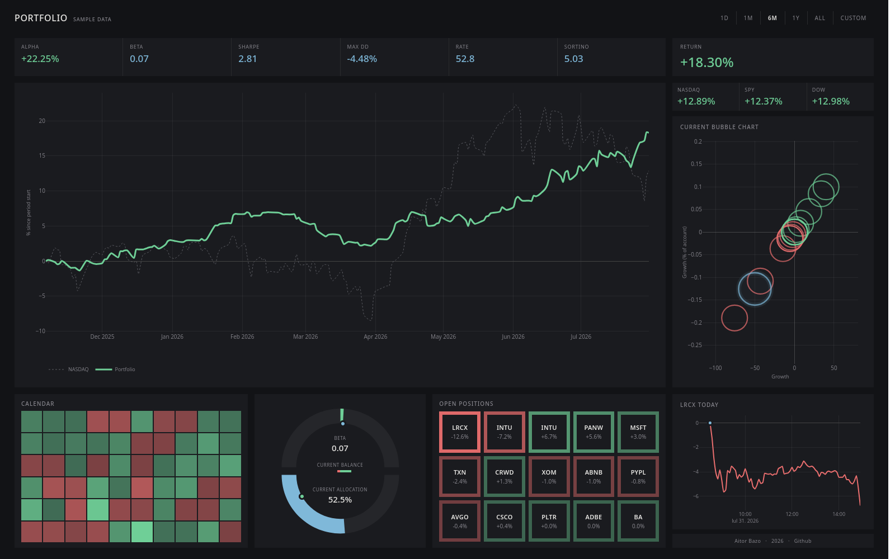

# Portfolio Dashboard

**Live demo: [aitor1717.github.io/fin_dash](https://aitor1717.github.io/fin_dash/)**



A simple but powerful finance dashboard for a trade-log CSV feed: historic and current-day
performance vs. benchmarks, plus standard portfolio/trade metrics (Sharpe,
Sortino, alpha/beta, drawdown, concentration, trade-level stats).

`pipeline/metrics.py` also computes an evaluation-style compliance panel
(profit target progress, trailing max-loss margin, concentration-band
status, price/volume floor violations) into every `dashboard.json` -- see
`compliance_panel()`. It isn't wired into the current UI yet; the raw
numbers are there for anyone who wants to add a panel for it.

See [`pipeline/generate_sample_feed.py`](pipeline/generate_sample_feed.py)
for how the sample data is built. Real, liquid tickers priced at their
actual historical closes. The trading activity itself (timing, side, win
rate) is generated, not derived from any real account. Real trade history
has no place in this repo and is gitignored; see "Running your own book"
below.

The data shown is a synthetic sample made for this demo. The page is static; the data
is only as fresh as the last local run that was committed.

## How it works

```
feed/*.csv  --(pipeline/build.py)-->  docs/data*/dashboard.json  --(docs/index.html)-->  browser
```

The feed has no position-size or account-size field by design, so `build.py`
applies a **buying-power-capped allocator**: each trade risks a configurable
% of a configurable account size, and a new trade is skipped if it would push
total open exposure over 100% of the account. Both are set in the config
YAML.

Benchmark history and per-ticker live prices / average volume come from
`yfinance` (no API key required, no guaranteed real-time accuracy).

## Setup

```bash
python3 -m venv .venv
source .venv/bin/activate
pip install -r requirements.txt
```

## Run

```bash
python pipeline/build.py --config config.sample.yaml
```

This writes `docs/data-sample/dashboard.json` (the demo dataset `docs/app.js`
loads by default). Open `docs/index.html` directly in a browser, or serve
the `docs/` folder locally:

```bash
python -m http.server --directory docs 8000
```

To regenerate the synthetic feed itself (new seed, different trade count,
etc.):

```bash
python pipeline/generate_sample_feed.py --out-feed feed/sample_feed.csv --seed 7
python pipeline/build.py --config config.sample.yaml
```

## Feed schema

`open_datetime,close_datetime,ticker,open_bid,open_ask,close_bid,close_ask,change,position,status,notes`

Long trades reconcile on the ask to open and the bid to close (`open_ask`
entry, `close_bid` exit); short trades reconcile the other way (`open_bid`
entry, `close_ask` exit). `status` (`open`/`closed`, case-insensitive) is
the authoritative lifecycle signal -- anything else is a data problem and
the parser raises.

## Running your own book

Copy `config.sample.yaml`, point `feed_path` at your own CSV, adjust
`account_size`/`position_weight_pct`, and give it its own `output_dir`
(e.g. `docs/data-personal`) so it doesn't overwrite the demo data. Then
point `docs/app.js`'s `DATA_PATH` constant at that `output_dir`'s
`dashboard.json` and rebuild. Add your feed and output paths to
`.gitignore` if they contain real trade data -- only fully synthetic data
belongs in a public fork of this repo.

Running several books or scenarios side by side just means repeating this
with a different config file and `output_dir` per scenario (own
account size, weight, or feed) -- there's no dataset switcher in the UI, so
comparing them means rebuilding and pointing `DATA_PATH` at one at a time.

## License

[LICENSE](LICENSE)
